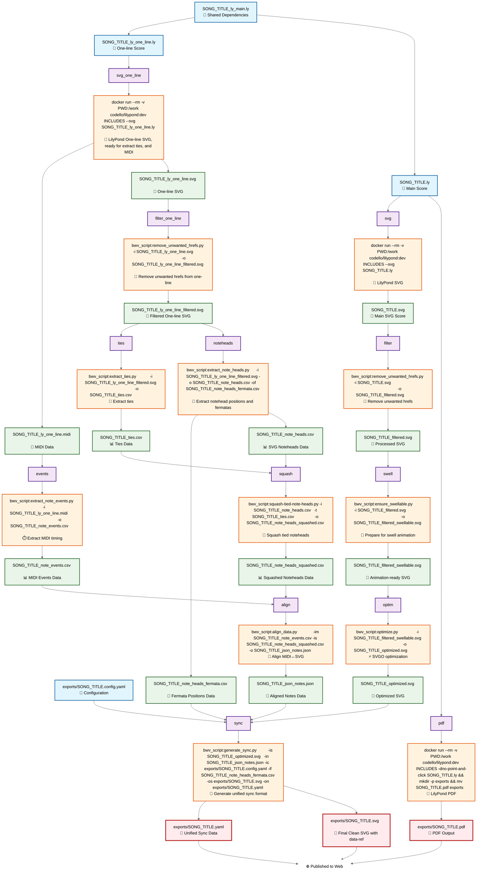

## 📊 Task Flow Diagram

```mermaid
%%{init: {'theme':'neutral'}}%%
graph TD

%% python tasks_mermaid_generator.py -i TASKS.mmd -o tasks_generated.py

%% ============================================================================
%% INPUT NODES
%% ============================================================================
I1[SONG_TITLE.ly<br/>📄 Main Score]
I2[SONG_TITLE_ly_one_line.ly<br/>📄 One-line Score]
I3[SONG_TITLE_ly_main.ly<br/>📄 Shared Dependencies]
I4[exports/SONG_TITLE.config.yaml<br/>📄 Configuration]

%% ============================================================================
%% TASK NODES
%% ============================================================================
T1[pdf]
T2[svg]
T3[svg_one_line]
T4[filter]
T5[swell]
T6[optim]
T7[noteheads]
T8[events]
T9[align]
T0[ties]
T11[squash]
T12[filter_one_line]
T13[sync]

%% ============================================================================
%% RUNNABLE NODES
%% ============================================================================
R1[docker run --rm -v PWD:/work codello/lilypond:dev INCLUDES -dno-point-and-click SONG_TITLE.ly && mkdir -p exports && mv SONG_TITLE.pdf exports   <br/>🐳 LilyPond PDF]
R2[docker run --rm -v PWD:/work codello/lilypond:dev INCLUDES --svg                SONG_TITLE.ly                                                <br/>🐳 LilyPond SVG]
R3[docker run --rm -v PWD:/work codello/lilypond:dev INCLUDES --svg                SONG_TITLE_ly_one_line.ly                                    <br/>🐳 LilyPond One-line SVG, ready for extract ties, and MIDI]
R4[bwv_script:remove_unwanted_hrefs.py   -i SONG_TITLE.svg                                                  -o SONG_TITLE_filtered.svg              <br/>🔗 Remove unwanted hrefs]
R5[bwv_script:ensure_swellable.py        -i SONG_TITLE_filtered.svg                                         -o SONG_TITLE_filtered_swellable.svg    <br/>🎯 Prepare for swell animation]
R6[bwv_script:optimize.py                -i SONG_TITLE_filtered_swellable.svg                               -o SONG_TITLE_optimized.svg             <br/>⚡ SVGO optimization]
R8[bwv_script:extract_note_events.py     -i SONG_TITLE_ly_one_line.midi                                     -o SONG_TITLE_note_events.csv           <br/>⏱️ Extract MIDI timing]
R7[bwv_script:extract_note_heads.py      -i SONG_TITLE_ly_one_line_filtered.svg -o SONG_TITLE_note_heads.csv -of SONG_TITLE_note_heads_fermata.csv    <br/>📍 Extract notehead positions and fermatas]
R0[bwv_script:extract_ties.py            -i SONG_TITLE_ly_one_line_filtered.svg                             -o SONG_TITLE_ties.csv                  <br/>🔗 Extract ties]
R11[bwv_script:squash-tied-note-heads.py -i SONG_TITLE_note_heads.csv   -t SONG_TITLE_ties.csv                  -o SONG_TITLE_note_heads_squashed.csv   <br/>🎵 Squash tied noteheads]
R9[bwv_script:align_data.py              -im SONG_TITLE_note_events.csv -is SONG_TITLE_note_heads_squashed.csv  -o SONG_TITLE_json_notes.json           <br/>🎯 Align MIDI↔SVG]
R12[bwv_script:remove_unwanted_hrefs.py  -i SONG_TITLE_ly_one_line.svg                                      -o SONG_TITLE_ly_one_line_filtered.svg  <br/>🔗 Remove unwanted hrefs from one-line]
R13[bwv_script:generate_sync.py          -is SONG_TITLE_optimized.svg   -in SONG_TITLE_json_notes.json -ic exports/SONG_TITLE.config.yaml -if SONG_TITLE_note_heads_fermata.csv -os exports/SONG_TITLE.svg -on exports/SONG_TITLE.yaml <br/>🎵 Generate unified sync format]

%% ============================================================================
%% OUTPUT NODES
%% ============================================================================
O2[SONG_TITLE.svg                       <br/>🎼 Main SVG Score]
O3[SONG_TITLE_ly_one_line.svg           <br/>🎼 One-line SVG]
O4[SONG_TITLE_ly_one_line.midi          <br/>🎵 MIDI Data]
O5[SONG_TITLE_filtered.svg              <br/>🔄 Processed SVG]
O6[SONG_TITLE_filtered_swellable.svg    <br/>🎯 Animation-ready SVG]
O7[SONG_TITLE_note_heads.csv            <br/>📊 SVG Noteheads Data]
O8[SONG_TITLE_note_events.csv           <br/>📊 MIDI Events Data]
O9[SONG_TITLE_ties.csv                  <br/>📊 Ties Data]
O10[SONG_TITLE_note_heads_squashed.csv  <br/>📊 Squashed Noteheads Data]
O11[SONG_TITLE_ly_one_line_filtered.svg <br/>🔄 Filtered One-line SVG]
O12[SONG_TITLE_optimized.svg            <br/>🎨 Optimized SVG]
O13[SONG_TITLE_json_notes.json          <br/>🎵 Aligned Notes Data]
O14[SONG_TITLE_note_heads_fermata.csv   <br/>🎯 Fermata Positions Data]

%% ============================================================================
%% EXPORT NODES
%% ============================================================================
E3[exports/SONG_TITLE.pdf               <br/>📑 PDF Output]
E1[exports/SONG_TITLE.svg               <br/>🎨 Final Clean SVG with data-ref]
E2[exports/SONG_TITLE.yaml              <br/>🎵 Unified Sync Data]

%% ============================================================================
%% DEPENDENCY RELATIONSHIPS
%% ============================================================================
%% Shared dependencies
I3 --> I1
I3 --> I2

%% Input to task relationships
I1 --> T1
I1 --> T2
I2 --> T3

%% Task to runnable relationships
T1 --> R1
T2 --> R2
T3 --> R3
T4 --> R4
T5 --> R5
T6 --> R6
T7 --> R7
T8 --> R8
T9 --> R9
T0 --> R0
T11 --> R11
T12 --> R12
T13 --> R13

%% Runnable to output relationships
R2 --> O2
R3 --> O3
R3 --> O4
R0 --> O9
R7 --> O7
R7 --> O14
R8 --> O8
R11 --> O10
R12 --> O11
R6 --> O12
R9 --> O13

%% SVG processing chain (main)
O2 --> T4
R4 --> O5
O5 --> T5
R5 --> O6
O6 --> T6

%% SVG processing chain (one-line)
O3 --> T12

%% Data extraction parallel branches (now from filtered one-line)
O11 --> T7
O11 --> T0
O4 --> T8

%% Squash tied noteheads step
O7 --> T11
O9 --> T11

%% Final data alignment (now uses squashed noteheads)
O10 --> T9
O8 --> T9

%% Sync generation step (final unification with fermata support)
O12 --> T13
O13 --> T13
O14 --> T13
I4 --> T13

%% Final export
R1 --> E3
R13 --> E1
R13 --> E2

%% ============================================================================
%% STYLING
%% ============================================================================
classDef input fill:#e1f5fe,stroke:#01579b,stroke-width:2px
classDef task fill:#f3e5f5,stroke:#4a148c,stroke-width:2px
classDef output fill:#e8f5e8,stroke:#1b5e20,stroke-width:2px
classDef runnable fill:#fff3e0,stroke:#e65100,stroke-width:2px
classDef export fill:#ffebee,stroke:#b71c1c,stroke-width:3px

class I1,I2,I3,I4 input
class T1,T2,T3,T4,T5,T6,T7,T8,T9,T0,T10,T11,T12,T13 task
class O2,O3,O4,O5,O6,O7,O8,O9,O10,O11,O12,O13,O14 output
class R1,R2,R3,R4,R5,R6,R7,R8,R9,R0,R11,R12,R13 runnable
class E3,E1,E2 export

%% ============================================================================
%% BOTTOM ALIGNMENT HACK
%% ============================================================================
T10["🌐 Published to Web"]
style T10 fill:#ffffff,stroke:#ffffff

E1 --> T10
E2 --> T10
E3 --> T10

```
